## Agenda

- [History Of AI](#History-Of-AI)
- [What is Artificial Intelligence ?](#What-is-Artificial-Intelligence-?)
- [AI Applications](#AI-Applications)
- [Types of AI](#Types-Of-AI)
- [Programming Languages for AI](#Programming-Languages-For-AI)
- [Machine Learning](#Introduction-to-Machine-Learning)
- [Machine Learning Algorithms](#Types-Of-Machine-Learning)
- Limitations of Machine Learning
- Deep Learning
- Neural Networks
- Natural Language Processing 

## History Of AI

**Greek Mythology - Talos**
Talos was a giant animated bronze warrior programmed to guard the island of Crete created by Hephaestus.

**1950 - Alan Turing**
Alan Turing published a landmark paper in which he speculated about the possibility of creating machines that think.

**1951 - Game AI**
Christoper Strachey wrote a checkers program and Dietrich Prinz wrote one for chess.

**1956 - The Birth of AI**
John McCarthy first coined the term "***Artificial Intelligence***" in 1956 at the Dartmouth Conference.

**1959 - First AI Laboratory**
MIT AI Lab was first set up in 1959. The research on AI began.

**1960 - General Motors Robot**
First robot was introduced to General Motors assembly line.

**1961 - First Chatbot**
The first AI chatbot called ELIZA was introduced in 1961.

**1997 - IBM Deep Blue**
IBM's Deep Blue beats world champion Garry Kasparov in the game of chess.

**2005 - DARPA Grand Challenge**
Standford Racing Team's autonomous robotic car.Stanley wins the 2005 DARPA Grand Challenge.

**2011 - IBM Watson**
IBM's question answering system. Watson defeated the two greatest Jeopardy! champion. Brad Rutter and Ken Jennings.

AI covers Domain like - Machine Learning, Deep Learning, Neural Networks, Natural Language Processing, Knowledge Base,  Expert Systems, Image Processing, Computer Vision and so .

**Demand of AI**

- More Computational Power ( GPU & NPU )
- More Data ( Big Data )
- Better Algorithms ( ML )
- Broad Invest

## What is Artificial Intelligence ?

John McCarthy first coined the term Artificial Intelligence in the year 1956.  
John McCarthy defined Artificial Intelligence as the science and engineering of making intelligent machines.

**What is AI ?**
> The Theory and Development  of computer systems able to performs tasks normally requiring human intelligence, such as visual perception, speech recognition, decision-making and translation between languages.

## AI Applications

- Google Search Engines

Based on users history, locations data, etc, AI model can predicts or guess user search.

- J.P. Morgan COiN

J.P. Morgan Chase's Contract Intelligence ( COiN ) platform uses AI, machine learning and image recognition software to analyze legal documents.

Manually reviewing 12,000 agreements takes over 36,000 hours. AI can do in a seconds.

- IBM Watson AI 

Healthcare organisation use IBM AI ( Watson ) technology for medical diagnosis.

-  Google AI Eye Doctor

Google AI Eye Doctor can examine retina scans and identify a condition called diabetic retinopathy.

- Facebook

Facebook uses Machine Learning & Deep Learning to detect facial features and tag your friends.

- X  ( formally Twitter )

X ( formally Twitter ) is using AI to identify hate speech and terroristic language in tweets.

The company discovered and banned 300, 000 terrorist-linked accounts, 95% of which were found by non-human, artificial intelligent machines.

- Google Duplex ( Virtual Assistant )

The Google Duplex can not only respond to calls and book appointments for you, it adds a human touch

- Tesla ( Self Driving Cars )

"Tesla will have fully self-driving cars ready by the end of the year and a "robo taxi" version - one that can ferry passengers without anyone behind the wheel - ready for the streets next year."

- Netflix

Over 75% of what you watch is recommended by Netflix. Recommendations are made by machine learning.

-  Gmail Spam Filtering

AI use to Filter out Spam and Authentic / Legit Email.

## Types Of AI

-  Artificial `Narrow` Intelligence
Artificial Narrow Intelligence ( ANI ) also known as weak AI involves applying AI only to specific tasks.

Examples : Alexa

- Artificial `General` Intelligence
Artificial General Intelligence ( AGI )  also known as strong AI, involves machines that possess the ability to performs any intellectual task that a human being can.

Example:  Alpha Go

- Artificial `Super` Intelligence
Artificial Super Intelligence ( ASI ) is a term referring to the time when the capability of computer will surpass humans.

Example: Not Exist yet ...

## Programming Languages For AI

- Python
- R language
- Java
- Lisp 
- Prolog
- C++

### Introduction to Python

- Python is an interpreted, object-oriented, high-level programming language with dynamic semantics.
- Python was created by Guido Rossum in 1989 and is very easy to learn.

- Simple and Easy to Learn - Python is a simple and easy to learn, read & write
- Free and Open Source - Python is an example of a FLOSS (Free/Libre and Open Source Software) which means one can freely distribute copies of this software, reads it's source code, modify it, etc.
- High-Level Language - One does not need to bother about the low-level details like memory allocations, etc. while writing Python script.
- Portable - Supported by many platforms like Linux, Windows, FreeBSD, Macintosh, Solaris, OS/2, Amiga, AROS, AS/400, BeOS, OS/390, PlayStation, Windows CE, etc.
- Supports different Programming Paradigm - Python supports procedure-oriented programming as well as object-oriented programming.
- Extensible - Python code can invoke C and C++ libraries, can be called from and C++ programs, can integrate with Java and .NET components.

## Introduction to Machine Learning

Machine Learning is subset of AI, AI learned pattern from ML from given dataset, it draws a pattern from it.

## Need for Machine Learning

"***"Over 2.5 quintillion bytes of data are created every single day, and it's only going to grow from there. By 2020, it's estimated that 1.7 MB of data will be created every seconds for every person on earth."***

- Cloud Data
- Internet Of Things
- Social Media

- Increase in Data Generation
- Improve Decision Making
- Uncovers patterns & trends in data
- Solve Complex Problems

## What is Machine Learning ?

Arthur Samuel first coined the term Machine Learning in the year 1959.

**What is Machine Learning**
>"A computer program is said to learn from experience E with respect to some class of tasks T and performance measure P if its performance at tasks in T, as measured by P, improves with experience E."

A simpler definition of Machine Learning
Machine learning is a subset of Artificial Intelligence ( AI ), which provides machines the ability to learn automatically & improve from experience without being explicitly  programmed.

Feed Data -> Training the Machine ->  Build a Model ->  Predicting Outcome

## Machine Learning Definitions

**Algorithm:** A set of rules and statistical techniques used to learn pattern from data.

**Model:** A model is trained by using a Machine Learning Algorithm.

**Predictor Variable:** It is a feature(s) of the data that can be used to predict the output.

**Response Variable:** It is a the feature or the output variable ( target variable ) that needs to be predicted by using the predictor variable(s).

**Training Data:** The Machine Learning model is built using the training data.

**Testing Data:** The Machine Learning model is evaluated using the testing data.

## Machine Learning Process

Steps to follow:
- Define Objectives 
- Data Gathering
- Preparing Data
- Data Exploration
- Building a Model
- Model Evaluation
- Predictions

**Machine Learning Process**
> The Machine Learning process involves building a **Predictive model** that can be used to find a **solution** for **Problem Statement**.

**Step 1: Define the objective of the Problem**
> To predict the possibility of rain by studying the weather conditions.

- What are we trying to predict? -> ( Continuous variable or Discrete variable )
- What are the target features? 
- What is the input data?
- What kind of problems we are facing? Binary classification ? Clustering ? Regression Problem ?

**Step 2: Data Gathering**
> Data such as weather conditions, humidity level, temperature, pressure, etc are either collected manually or scarped from web.

**Step 3: Preparing Data
> Data Cleaning involves getting rid of inconsistencies in data such as missing values or redundant variables.

- Transforms data into desired format
- Data Cleaning
	- Missing values
	- Corrupted data
	- Remove unnecessary data

**Step 4: Exploratory Data Analysis**
> Data Exploration involves understanding the patterns and trends in the data. At this stage all the useful insights are drawn and correlations between the variables are understood.

**Step 5: Building a Machine Learning Model**
>At this stage a Predictive Model is built by using Machine Learning Algorithms such as Linear Regression, Decision Trees, etc.

Split data into two parts: training  data (80%) & testing data. (20%).

- Machine Learning model is built by using the training data set.
- The model is the Machine Learning algorithms that predicts the output by using the data fed to it.

**Step 6: Model Evaluation & Optimization**
>The efficiency of the model is evaluated and any further improvement in the model are implemented.

- Machine Learning model is evaluated by using the testing data set.
- The accuracy of the model is calculated.
- Further improvement in the model are done by using techniques like Parameter tuning.

**Step 7: Predictions**
> The final outcome is predicted after performing parameter tuning and improving the accuracy of the model.

## Types Of Machine Learning 

- Supervised Learning 
- Unsupervised Learning
- Reinforcement Learning

### Supervised Learning 

Supervised learning is a technique in which we teach or train the machine using data which is well labelled.

Labelled data -> ML Algorithms -> classes of labelled data

You have well labelled dataset, take an example Tom & Jerry, You feed Tom and Jerry how they looks and basis on that Algorithm will classify or separate them forming class of Tom contains tom data and class jerry contains jerry data.
### Unsupervised Learning

Unsupervised learning is the training of machine using information that is unlabelled and allowing the algorithms to act on that information without guidance.

Unlabelled data -> ML  Algorithms -> Clusters formed on features

Take previous example of Tom & Jerry, In Unsupervised learning data is unlabelled, on building model, model will identify features as of Big Ears, skins etc, on basis of that data, it output as grouping the type a and type b , clustering basis on features on type a and type b,  Compare appearance both of them - Tom & Jerry.

### Reinforcement Learning

Reinforcement Learning is a part of Machine learning where an agent is put in an environment and he learns to behave in this environment by performing certain actions and observing the rewards which it gets from those actions.

In Reinforcement Learning , we don't give data, we put Agent AI, in a environment, and Agent AI had to explore, without knowing anything of it's environment, on basis of actions it gets rewards or  punishment, AI learn will learn which things to do and not to do.

### Difference  

|                    | Supervised Learning                                                      | Unsupervised Learning                                           | Reinforcement Learning                                                                      |
| ------------------ | ------------------------------------------------------------------------ | --------------------------------------------------------------- | ------------------------------------------------------------------------------------------- |
| Definition         | The machine learns by using labelled data.                               | The machine is trained on unlabelled data without any guidance. | An agent interacts with its environment by producing actions & discovers errors or rewards. |
| Types of Problems  | Regression & Classification                                              | Association & Clustering                                        | Reward based                                                                                |
| Types of data      | Labelled data                                                            | Unlabelled data                                                 | No pre-defined data                                                                         |
| Training           | External supervision                                                     | No supervision                                                  | No supervision                                                                              |
| Approch            | Map labelled input to known output                                       | Understand patterns and discovers output                        | Follow trail and error method                                                               |
| Popular Algorithms | Linear regression, Logistic regression, Support Vector Machine, KNN, etc | K-means, C-means, etc                                           | Q-learning, SARSA, etc                                                                      |

## Types of Problems Solved Using Machine Learning

**Regression vs Classification vs Clustering**

| Regression                         | Classification                                  | Clustering                                               |
| ---------------------------------- | ----------------------------------------------- | -------------------------------------------------------- |
| Supervised Learning                | Supervised Learning                             | Unsupervised Learning                                    |
| Output is continuous quantity      | Output a categorical quantity                   | Assigns data points into clusters                        |
| Main aim is to forecast or predict | Main aim is to compute the category of the data | Main aim is to group similar items clusters              |
| Eg. Predict  stock market price    | Eg. Classify emails as spam or non-spam         | Eg. Find all transactions which are fraudulent in nature |
| Algorithm: Linear Regression       | Algorithm: Logistic Regression                  | Algorithm: K-means                                       |

**Problem Statement**: To study the House Sales dataset and build a Machine Learning model that  predicts the house pricing index. : 
> Linear Regression Algorithm to predict the house pricing index. 

**Problem Statement**: Study a bank credit dataset and make a decision about whether to approve the loan of an applicant based on profile. :
> KNN Algorithm - Approve Loan OR  Reject Loan

**Problem Statement**: To cluster a set of movies as either good or average based on their social media out reach. :
> K-means Algorithm - Popular Movies OR Non-popular Movies

### Supervised Learning Algorithms

- Linear Regression
- Logistic Regression
- Decision Tree
- Random Forest
- Naive Bayes Classifier
- K-Nearest Neighbour
- Support Vector Machines

#### Linear Regression 

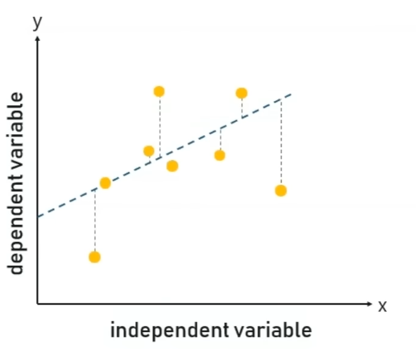

Linear Regression is a method to predict dependent variable (Y) based on values of independent variables (X). It can be used for the cases where we want to predict some continuous quantity.

- Dependent variable (Y):
>  The response variable who's value needs to be predicted.

- Independent variable (X):
> The predictor variable used to predict the response variable.

The following equation is used to represent a linear regression model:

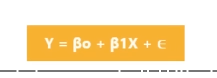

1. Dependent variable
2. Y intercept
3. Slope
4. Independent variable
5. Error

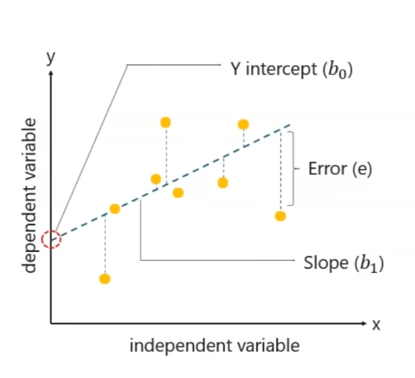

#### Logistic Regression

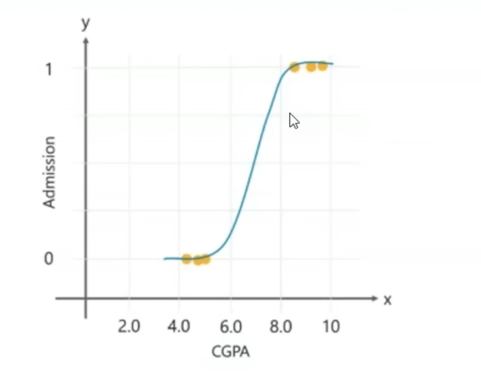

Logistic Regression is a method used to predict a dependent variable, given a set of independent variables, such that the dependent variable is categorical.

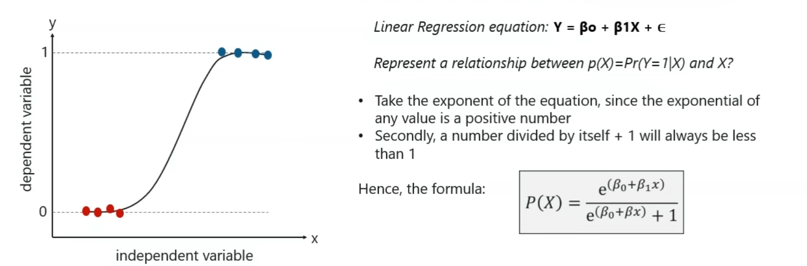

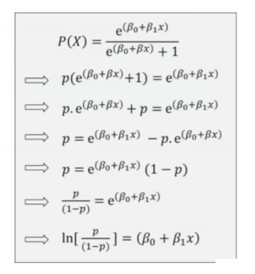

#### Decision Tree

A Decision Tree is a Supervised Machine Learning algorithm which looks like an inverted tree, wherein each node represents a **predictor variable** (feature), link between the nodes represents a **Decision** and each leaf node represents an **outcome** (response variable).

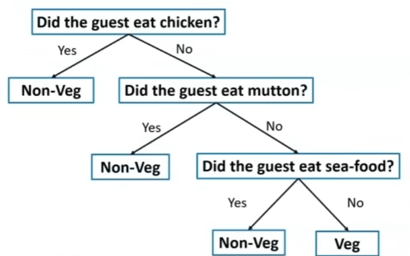

**Root Node**: 
> The root node is the starting point of a tree. At this point, the first split is performed.

**Internal Node**:
> Each internal node represents a decision point (predictor variable) that eventually leads to the prediction of the outcome.

**Leaf / Terminal Node**:
> Leaf nodes represents the final class of the outcome and therefore they're also called terminating nodes.

**Branches**:
> Branches are connection between nodes, they're represented as arrows. Each branch represents a response such as yes or no.

**Steps to Follows:**

**Step 1**: Select ***Best Attributes ( A )***

**Step 2**: Assign A as decision variable for the root node.

**Step 3**: For each value of A, build a descendant of the node.

**Step 4**: Assign classification labels to the leaf node.

**Step 5**: If data is correctly classified: Stop.

**Step 6**: Else: Iterate over the tree.

**Information Gain & Entropy**

**Problem Statement**: To study the data set and create a Decision Tree that classifies the speed of a car as either slow or fast.

| Road type | Obstruction | Speed Limit | Speed |
| --------- | ----------- | ----------- | ----- |
| steep     | yes         | yes         | slow  |
| steep     | no          | yes         | slow  |
| flat      | yes         | no          | fast  |
| steep     | no          | no          | fast  |

**Step 1**:  Select Best Attributes (A)

Q. How do you know which variable best separates the data?
Ans. : The variable with the highest information Gain best divides the data into the desired output classes.

Calculate the following measures:
1. Entropy
2. Information Gain ( IG )

**Entropy**: Entropy measures the impurity or uncertainty present in the data.

**Information Gain**: IG indicates how much "information" a particular feature / variable gives us about the final outcome.

**Calculating IG of parent node ( Speed of Car )**

Find out the fraction of the two classess (slow or fast) present in the parent node:
- P(slow) -> fraction of  'slow' outcomes in the parent node
- P(fast) -> fraction of 'fast' outcomes in the parent node

The formula of calculate P(slow) is:
**P(slow) = no. of 'slow' outcomes in the parent node / total number of outcomes**

P(slow) = 2/4 = 0.5

Similarly for P(fast),

**P(fast) = no. of 'fast' outcomes in the parent node / total number of outcomes**

P(fast) = 2/4 = 0.5

Therefore, the entropy of the parent node is:
**Entropy(parent) = ...**
Entropy(parent) = 1

Calculating IG of child node (Road Type)

Entropy of right side child node(fast)
Entropy of left side child node (slow, slow , fast)

P(slow) = 2/3 = 0.667
P(fast) = 1/3 = 0.334

Therefore, the entropy is:
Entropy(left child node) = {(0.667 log2(0.667)) + 0.334 log2(0.334)} = -{-0.38+(-0.52))} = 0.9

calculate the Entropy (children) with weighted average:
- Total number of outcomes in parent node: 4
- Total number of outcomes in left child node: 3
- Total number of outcomes in right child node: 1

> \[Weighted avg]Entropy(children) = (no. of outcomes in left child node) / (total no. of outcomes in parent node) + (entropy of left node) + (no. of outcomes in right child node) / (total no. of outcomes in parent node) * (entropy of right node)

Entropy(children) with weighted avg. is 0.675

**`Information Gain = entropy(parent) - [weighted average] * entropy(children)`**

Therefore, 
Information Gain(Road type) = 1 - 0.675 = 0.325

So by using the above methodology, you must get the following values for each predictor variable:
- Information Gain (Road type) = 1 - 0.675 = 0.325
- Information Gain (Obstruction) = 1 - 1 = 0
- Information Gain (Speed limit) = 1 - 0 = 1 

#### Random Forest 

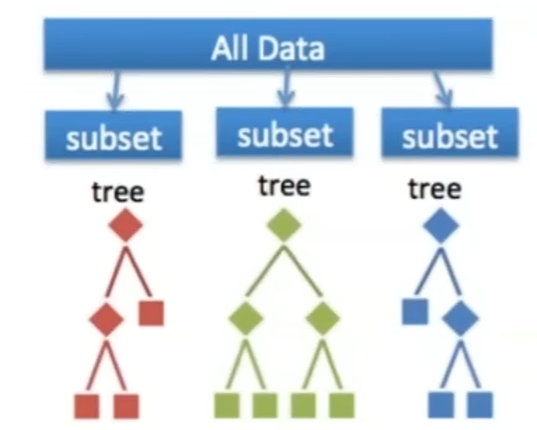

Random Forest builds multiple decision trees (called the forest) and glues them together to get a more accurate and stable prediction.

Why Random Forest ?
- More Accuracy
- Avoid Overfitting
- Bagging

We're going to use this data set to create a Random Forest that predicts if a person has heart disease or not.

| Blood Flow | Blocked Arteries | Chest Pain | Weight | Heart Disease |
| ---------- | ---------------- | ---------- | ------ | ------------- |
| Abnormal   | No               | No         | 130    | No            |
| Normal     | Yes              | Yes        | 195    | Yes           |
| Normal     | No               | Yes        | 218    | No            |
| Abnormal   | Yes              | Yes        | 180    | Yes           |

**Step 1**: Create a Bootstrapped Data Set
Bootstrapping is an estimation method used to make prediction on a data set by re-sampling it.

| Blood Flow | Blocked Arteries | Chest Pain | Weight | Heart Disease |
| ---------- | ---------------- | ---------- | ------ | ------------- |
| Abnormal   | Yes              | Yes        | 195    | Yes           |
| Abnormal   | No               | No         | 130    | No            |
| Abnormal   | Yes              | Yes        | 180    | Yes           |
| Abnormal   | Yes              | Yes        | 180    | Yes           |

**Step 2**: Creating Decision Trees

- Build a Decision Tree by using the bootstrapped data set
- Begin at the root node & choose the best attribute to split the data set
- Repeat the same process for each of the upcoming branch nodes

**Step 3**: Go back to Step 1 and Repeat

- Each Decision Tree predicts the output class based on the respective predictor variables used in that tree.
- Go back to step 1, create a new bootstrapped data set and then build a Decision Tree by considering only a subset of variables at each step.
- This iteration is performed 100's of times, creating multiple decision trees.

**Step 4**: Predicting the outcome of a new data point

- To predict whether a new patient has heart disease or not, run the new data down the decision trees
- After running the data down all the trees in the Random Forest, we check which glass got the majority votes.
- In our case, the class 'Yes' received the most number of votes, hence it's clear that the new patient has heart disease.

**Step 5**: Evaluate the Model

- In a real-world problem, about 1/3rd of the original data set is not included in the bootstrapped data set.
- This sample data set that does not include in the bootstrapped data set is known as the Out-Of-Bag (OOB) data set.
- we can measure the accuracy of a Random Forest by the proportion of OOB samples that are correctly classified.
- 
#### Naive Bayes

- Naive Bayes is based on the Bayes Theorem that is used to solve classification problems by following a probabilistic approach.
- It is based on the idea that the predictor variables in a Machine Learning model are independent of each other.

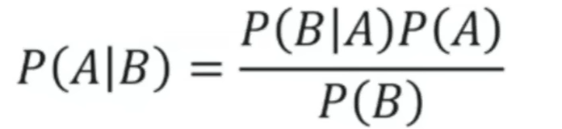

- P( A|B ): Conditional probability of event A occurring, given the event B
- P( A ): Probability of event A occurring
- P( B ): Probability of event B occurring
- P( B|A ): Conditional probability of event B occurring, given the event A

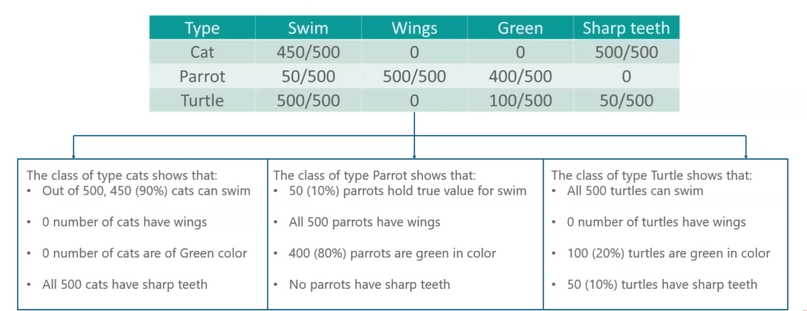

To predict whether the animal is a Cat, Parrot or a Turtle based on the defined predictor variables (swim, wings, green , sharp teeth).

|             | Swim | Wings | Green | Sharp Teeth |
| ----------- | ---- | ----- | ----- | ----------- |
| Observation | True | False | True  | False       |

To solve this, we will use the Naive Bayes Approach:

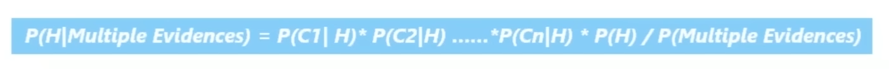

In the observation, the variables Swim and Green are true and the outcome can be any one of the animals (Cats, Parrots, Turtles).

**To check if the animals is a cat**:
> P( Cat | Swim, Green) = P( Swim|Cat ) * P( Green|Cat ) * P( Cat ) / P(  Swim, Green )
> = 0.9 * 0 * 0.333 / P( Swim, Green ) 
> = 0

**To check if the animals is a parrot**:
> P( Parrot | Swim, Green) = P( Swim|Parrot ) * P( Green|Parrot ) * P( Parrot ) / P(  Swim, Green )
> = 0.1 * 0.80 * 0.333 / P( Swim, Green ) 
> = 0.0264 / P( Swim, Green )

**To check if the animals is a Turtle**
> P( Turtle | Swim, Green) = P( Swim|Turtle ) * P( Green|Turtle ) * P( Turtle ) / P(  Swim, Green ) 
> = 1 * 0.2 * 0.333 / P( Swim, Green ) 
> = 0.0666 / P( Swim, Green )

#### K Nearest Neighbour ( KNN )

K Nearest Neighbour is a Supervised Learning Algorithm that classifies a new data point into the target class, depending on the features of it's neighbouring data points

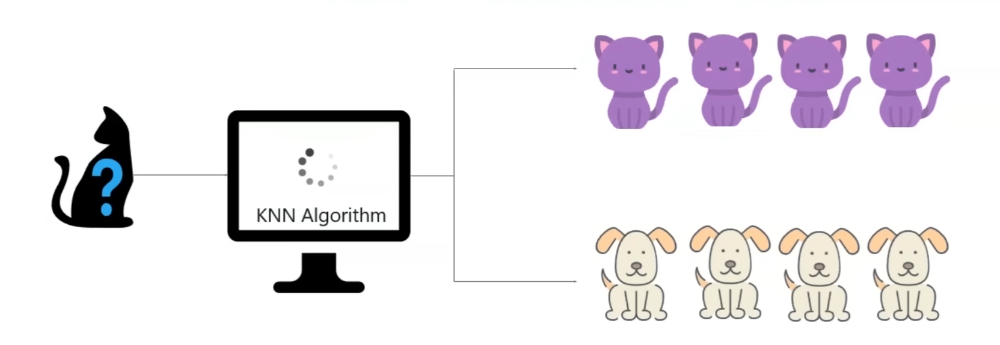

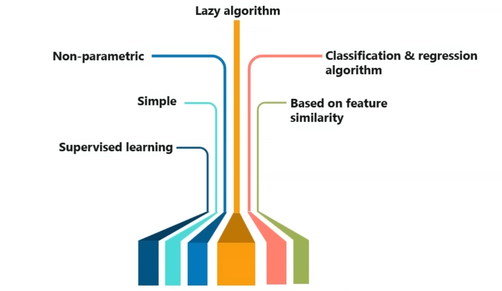

**Problem Statement**: Assign the new data point into one of the two clusters

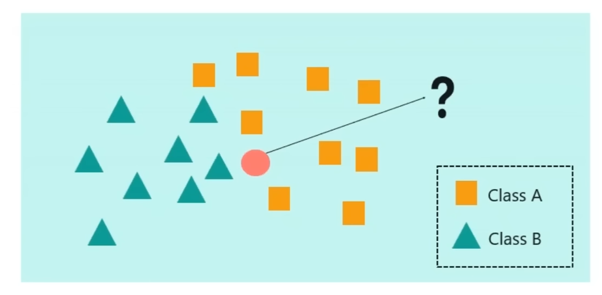

Choose the value of 'k', here k=3 and find the 3 nearest neighbours

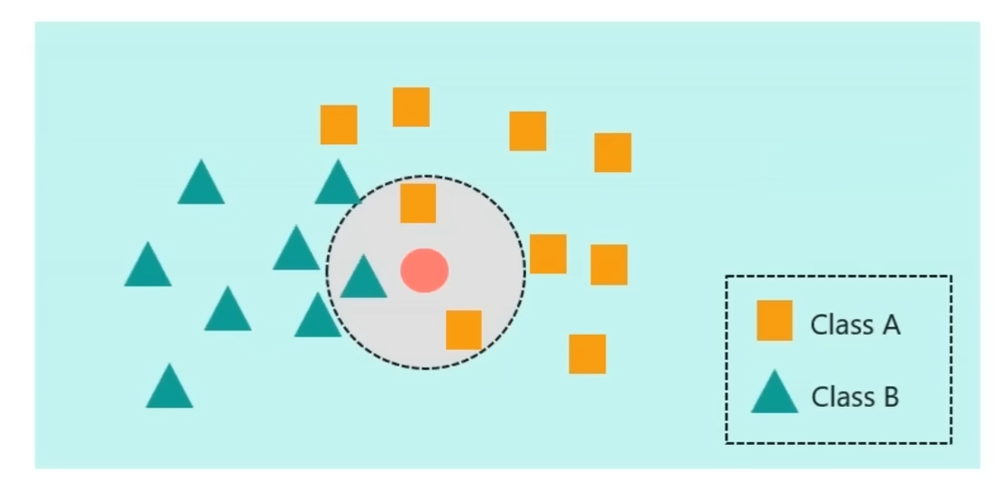

=> Class A or Square 

Here k= 7, find the nearest neighbours

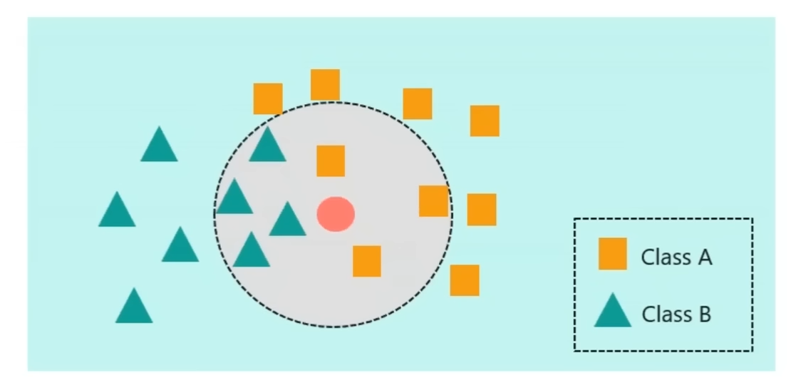

##### Euclidean Distance

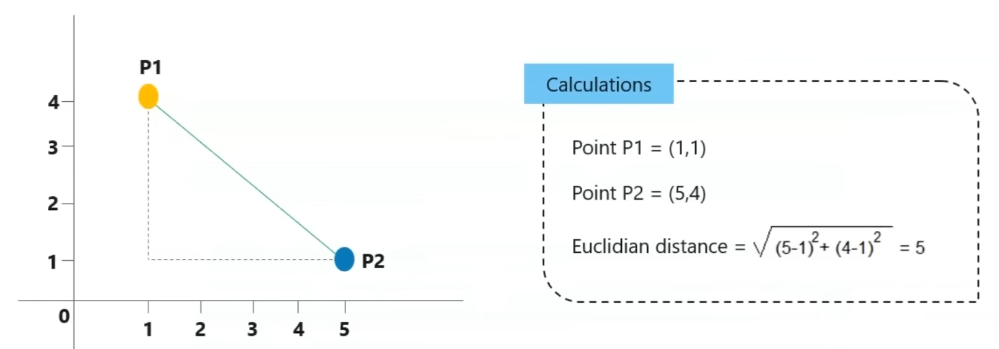

#### Support Vector Machine ( SVM )

Support Vector Machine ( SVM ) is a supervised classification  method that separates data using hyperplanes.

- Supervised machine learning algorithm
- Classification & Regression algorithm
- SVM kernel functions

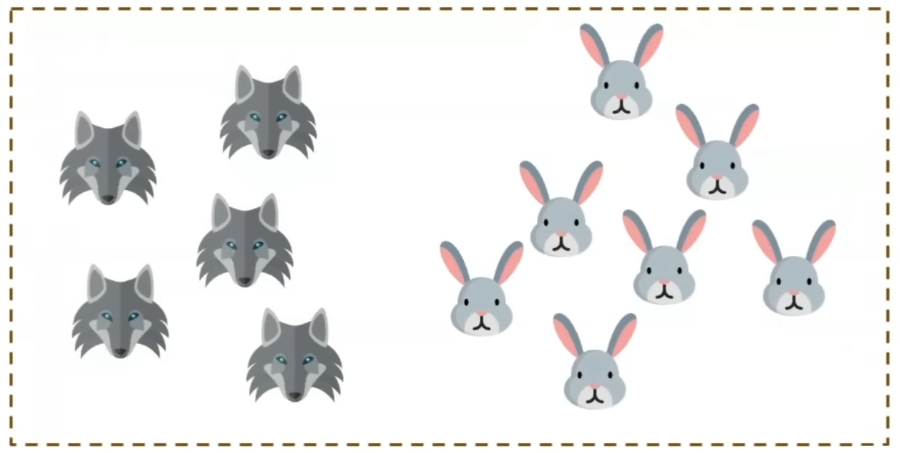

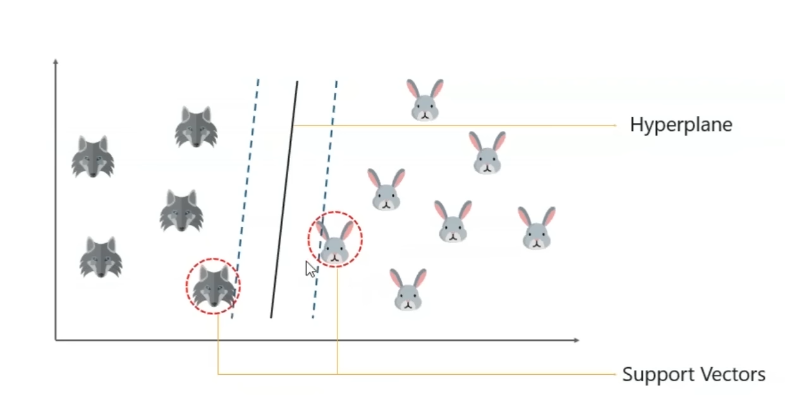

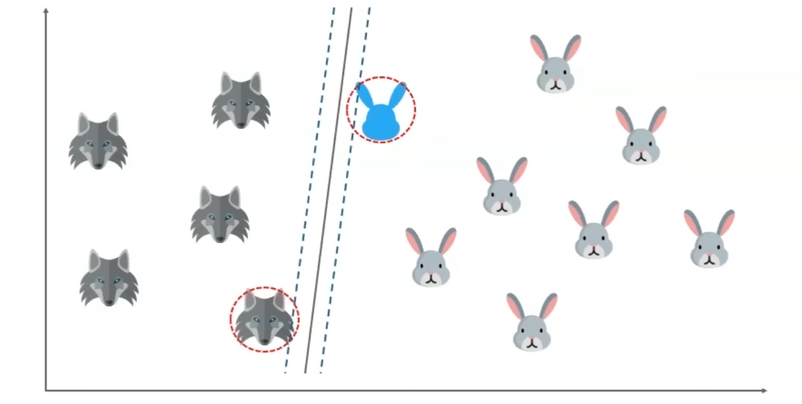

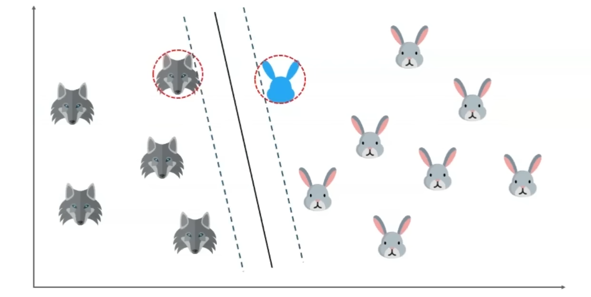

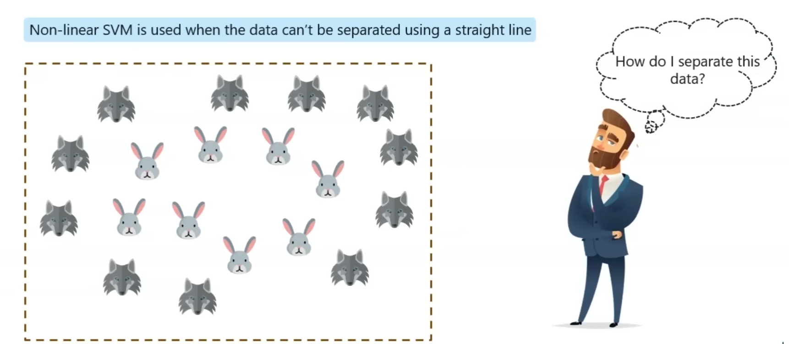

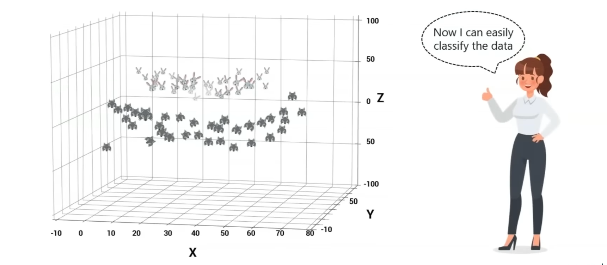

### Unsupervised Learning Algorithms

## Reference

- [Artificial Intelligence Full Course | By Edureka!](https://www.youtube.com/watch?v=JMUxmLyrhSk)